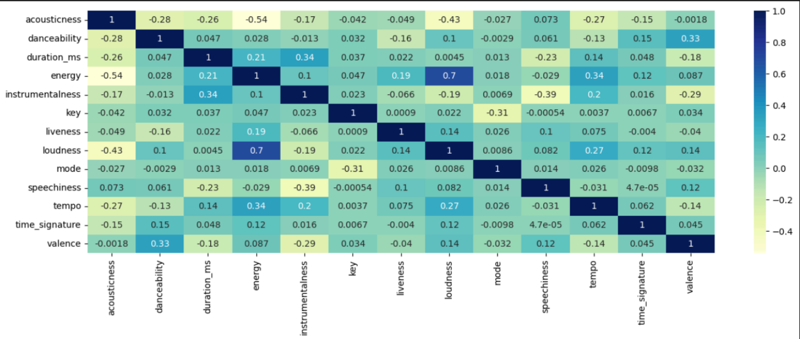

# Spotify Genre Classifier

## Motivation

In the ever-expanding landscape of digital music, the ability to accurately classify songs into their respective genres is not only a fundamental task but also a challenging endeavor. With the exponential growth of music streaming platforms and digital libraries, there is an increasing demand for robust and efficient methods to organize and categorize the vast amounts of available music.

This project aims to leverage the power of big data analytics to tackle the complex task of song genre classification. Unlike traditional approaches that rely solely on manual tagging or simplistic rule-based systems, our approach harnesses the wealth of information embedded within the audio features and lyrical content of songs.

## Datasets used

- [Audio Features and Lyrics of Spotify Songs](https://www.kaggle.com/datasets/imuhammad/audio-features-and-lyrics-of-spotify-songs/code)
- [10+ M Beatport Tracks / Spotify Audio Features](https://www.kaggle.com/datasets/mcfurland/10-m-beatport-tracks-spotify-audio-features)

## Data Preprocessing

### Normalize Numeric Features Using Map-Reduce

We have 2 Map-Reduce stages:

1. The first stage takes a feature's values and computes the sum, sum of squares, and count. In the reduce stage, these values are used to get the mean and standard deviation of each feature to perform z-score normalization.
2. The second stage computes the absolute maximum value for each feature after applying z-score normalization, then uses this value to normalize the range of our values from -1 to 1 [-1, 1].

### Lyrics preprocessing

The preparation of the lyrics for the model involves several steps to transform raw text data into a format suitable for training and embedding in the model:

1. **Tokenization**: 
   - The lyrics are first tokenized using `RegexTokenizer` from PySpark. This process involves splitting the raw text into individual words or tokens based on a specified pattern (`pattern="\\W"`), which typically separates words based on non-word characters like spaces, punctuation, etc.

2. **Stopwords Removal**:
   - Stopwords (commonly occurring words like "the", "is", "and", etc.) are removed from the tokenized lyrics to focus on more meaningful words.

3. **Text Cleaning**:
   - Text cleaning steps like lowercase conversion, removing special characters, or handling irregularities in the text data can be performed depending on the specific preprocessing needs of the dataset.

4. **Sequence Padding**:
   - After tokenization, the lyrics are converted into sequences of integers (word indices) using Keras `Tokenizer`. This involves fitting the `Tokenizer` on the tokenized lyrics to create a vocabulary and then converting the tokenized lyrics into sequences of integers based on this vocabulary.

5. **Padding Sequences**:
   - The sequences of integers (representing tokenized lyrics) are padded to ensure uniform length (`max_len`) across all sequences. This is achieved using `pad_sequences` from Keras, which pads sequences shorter than `max_len` and truncates sequences longer than `max_len`.

6. **Embedding Initialization**:
   - An embedding matrix (`embedding_matrix`) is created based on pre-trained word embeddings (GloVe embeddings). Each word in the vocabulary is associated with a pre-trained embedding vector, which initializes the embedding layer in the model. This step ensures that the model starts with meaningful word representations learned from large text corpora.

7. **Model Input Preparation**:
   - Finally, the tokenized and padded lyrics (`X_train_lyrics_padded`, `X_val_lyrics_padded`) are used as inputs to the model along with the corresponding audio features (`X_train_audio`, `X_val_audio`). These inputs are fed into the model during training (`model.fit`) to jointly learn from both text and audio modalities for the classification task.

In summary, the preparation of the lyrics involves tokenization, sequence padding, embedding initialization with pre-trained embeddings, and integration into the model.

**Note:**
 We used two datasets. The first one was only 18k songs and had a bad distribution of genres —one genre had 1500 songs while others had 4000— so it didn’t yield good results at classification. We decided to use the second dataset wand choose 6 genres from with 20k song in each genre.

The following EDA is done on the new Dataset.

## EDA

### Cross-Correlation Matrix

We tried to draw a cross-correlation matrix between all the numeric features to understand how well they correlate and check if we can remove any of them if they have strong correlation with each other. The only two features that had a kind of correlation were loudness and energy with a positive correlation of 0.7. But we decided to leave the two features as they aren’t strongly correlated (>0.8).

### KDE (Kernel Density Estimate) plot per feature

To further understand our numeric features according to each genre, we plotted the distribution of genres according to each feature. In summary, we found that some features have nearly no effect on the classification process because the distribution of genres in these features is nearly identical. These features are: Duration, time_signature, and mode. When trying to remove these features from our classification process, they affected only the Random forest classifier by 2%.

#### Good Features

    
    

#### Bad Features

    
    

## Methodology

### Overview of Model Approaches

This section outlines two approaches designed to classify song genres, each leveraging different sets of features and architectures to achieve the task.

### Neural Networks Based Classifiers

#### Model 1: Hybrid Text and Audio Model

**Architecture:**

- **Textual Input Branch**: This branch handles the textual lyrics, which are converted into sequences of integer tokens. These tokens are then passed through an embedding layer initialized with pre-trained word embeddings. This layer remains static during training to capitalize on existing semantic knowledge. Following this, a bidirectional LSTM layer processes the sequences to capture contextual information from the lyrics in both forward and backward directions.
- **Audio Input Branch**: Simultaneously, audio features extracted from the songs are fed directly into the model. These features do not undergo preliminary transformations, maintaining the raw audio data integrity.
- **Concatenation and Processing**: Outputs from both branches are merged and processed through several dense layers with ReLU activation functions, which facilitate learning of intricate relationships between the combined features.
- **Output**: A softmax layer concludes the architecture, delivering a probability distribution over predefined song genres.

**Training:**

- The model uses the Adam optimizer and categorical cross-entropy loss, with a focus on maximizing accuracy.

#### Model 2: Audio-Only Model

**Architecture:**

- **Single Input Branch**: This model solely processes audio features, which are represented as vectors of floating-point values capturing various acoustic properties of the songs.
- **Dense Layers**: The audio vectors pass through a series of dense layers, beginning with 128 units followed by 64 units, both employing ReLU activation. These layers aim to extract and learn hierarchical patterns that are indicative of different music genres.
- **Output**: The architecture culminates in a dense softmax layer that predicts genre categories based on the processed audio features.

**Training:**

- Similar to the LSTM model, this model utilizes the Adam optimizer and categorical cross-entropy loss, aiming for high accuracy in genre classification.

### Classic Classification Classifiers

Classification Models Used Only for audio features:

We used 4 different classification models to try to classify our songs using only audio features. All these models were trained on 80% of the data, and testing was done on the other 20%.

#### Random Forest Classifier

Parameters used: `numTrees=200, maxDepth=20`

#### DecisionTreeClassifier

Parameters used: `maxDepth=30, maxBins=128`

#### Logistic Regression classifier

Parameters used: `maxIter=100000, regParam=0, elasticNetParam=0`

#### SVM (Support Vector Machine)

Parameters used: `kernel="rbf", break_ties=True`

## Results

### Model 1: Hybrid Text and Audio Model (Done on first Dataset)

AUC Score: 0.8519

### Model 2: Audio-Only Model (Done on first Dataset)

AUC Score: 0.5656

### Random Forest (Done on second Dataset)

### Decision Tree Classifier (Done on second Dataset)

### Linear Regression (Done on second Dataset)

### SVM (Done on second Dataset)

## Conclusion
 Genres like **Minimal/Deep Tech** and **psy-trance** were easy to recognize, while **electronica** and **Disco** were harder to classify. This can be explained by the fact that they don’t have much significance in terms of distributions in different genres.
